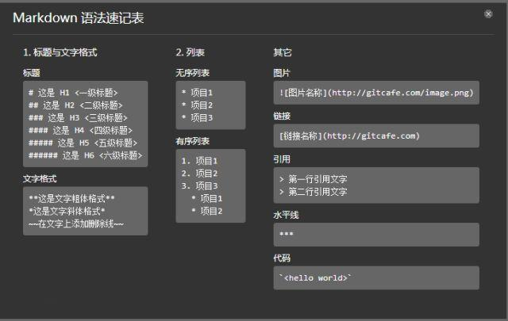

---
meta:
  - name: referrer
    content: no-referrer
---

Markdown 语法入门
=================

::: tip Tips
该篇幅只介绍一些常用的基本语法，继续学习,请 [移步](https://www.appinn.com/markdown)。
:::

### 常用语法概览


<!--  -->

<!-- ## here

::: danger 提示
This is a dangerous warning, and the anchors will come here
::: -->

### 标题的写法

标题总共有六级，在 `#` 号后面加个空格，这是标准Markdown写法

```bash
# 一级标题
## 二级标题
### 三级标题
#### 四级标题
##### 五级标题
###### 六级标题
```

<!-- # 一级标题
## 二级标题
### 三级标题
#### 四级标题
##### 五级标题
###### 六级标题 -->

### 换行和分段

* 换行：只需要在行末加2个空格键和一个回车键即可
* 分段：段落之间空一行即可

<!-- #### 未换行

我还没有换行
哦

#### 换行了

我换行了  
哦 -->

<!-- #### 分段

我分段了

哦 -->

### 文本样式

如果在段落中需要展示加粗，就需要在符号前后空出来1格

```bash
** 加粗 **
* 斜体 *
~~ 删除线 ~~
` 底纹 `
```

<!-- **加粗** 
*斜体*
~~删除线~~
` 底纹 ` -->

### 列表

* 无序列表 在文字前加 `*` 或 `-`

* 有序列表 在文字前加 `数字.`

```bash
#### 无序列表

* 1
* 2
  * 2.1
  * 2.2
      * 2.2.1
      * 2.2.2
        * 2.2.2.1
        * 2.2.2.2
  * 2.3

#### 有序列表

1. 1
2. 2
    1. 2.2.1
    2. 2.2.2
3. 3

#### 有序无序列表混合

1. 1
2. 2
    * 2.1
    * 2.2
        1. 2.2.1
        2. 2.2.2
```

#### 无序列表

* 1
* 2
  * 2.1
  * 2.2
      * 2.2.1
      * 2.2.2
        * 2.2.2.1
        * 2.2.2.2
  * 2.3

#### 有序列表

1. 1
2. 2
    1. 2.2.1
    2. 2.2.2
3. 3

#### 有序无序列表混合

1. 1
2. 2
    * 2.1
    * 2.2
        1. 2.2.1
        2. 2.2.2

### 引用

只要在文本内容之前 加 `>` 即可将文本变成引用文本

```bash
> 我是引用文本
```

<!-- > 我是引用文本 -->

### 图片与链接

如果只是简单的插入图片和链接，那么非常简单。两者仅仅是一个 `!` 号的区别

* 图片
```bash

```

* 图片居中

```bash
<div align="center">
  
</div>
```

* 链接
```bash
[百度一下，你就知道](https://www.baidu.com)
```

<!-- 

[百度一下，你就知道](https://www.baidu.com) -->

* 内部链接

以如下的文件结构为例：

```md
  .
  ├─ README.md
  ├─ foo
  │  ├─ README.md
  │  ├─ one.md
  │  └─ two.md
  └─ bar
    ├─ README.md
    ├─ three.md
    └─ four.md
```

假设你现在在 foo/one.md 中：

```md
  [Home](/) <!-- 跳转到根部的 README.md -->
  [foo](/foo/) <!-- 跳转到 foo 文件夹的 index.html -->
  [foo heading](./#heading) <!-- 跳转到 foo/index.html 的特定标题位置 -->
  [bar - three](../bar/three.md) <!-- 具体文件可以使用 .md 结尾（推荐） -->
  [bar - four](../bar/four.html) <!-- 也可以用 .html -->
```
* html语法的连接

但如果是在markdown中写html语法的超链接，就需要用到系统内置的 `$withBase` 方法：

```html
<ul>
  <li>
    <a :href="$withBase(`/docs/guide.html`)">文档编写技巧</a>
  </li>
</ul>

<!--
build之后就会变成`{base}/docs/guide.html`
-->
```

扩展名 `.html` 也需要加上

### 水平线

三个 `*` 或 `-` 都可以画出一条水平分割线

```bash
---
***
```
<!-- 
#### `-` 分割线
---

#### `*` 分割线
*** -->

### 代码框

两对 ` ``` ` 包裹 后可跟语言类型 如： javascript、css、 html、 bash、 shell、 md等

```
system.out.print('Hello World')
```

``` javascript
console.log("Hello World");
```

``` css
.class {
  color: red;
  font-size: 14px;
} 
```

``` html
<div>
  <p>This is a p</p>
  <span>This is a span</span>
</div>
```

### 锚点

其实呢，每一个标题都是一个锚点，和HTML的锚点（#）类似，但是不能包含空格、不能包含中文字符

```bash
[回到here](#here)
```

<!-- #### 上面有示例，注意

[回到here](#here) -->


### 自定义容器

由两对 `:::` 包裹 tip提示主要有三种提示，tip：普通提醒、 waring： 警告提醒、 danger： 危险提醒, 后可跟文案信息，也可不跟

``` bash
#### 普通提醒
::: tip 普通提醒
这是普通提醒
:::

#### 警告提醒
::: warning 警告提醒
这是警告提醒
:::

#### 危险提醒
::: danger 危险提醒
这是危险提醒
:::
```
<!-- #### 普通提醒
::: tip 普通提醒
这是普通提醒
:::

#### 警告提醒
::: warning 警告提醒
这是警告提醒
:::

#### 危险提醒
::: danger 危险提醒
这是危险提醒 -->

### 展开原文

展开原文用法比较少见，但是这种写法和普通的md写法有区别，其实很简单，就是普通的html标签写法，直接写在md文档里就可以

```html
<details>
  <summary>展开原文</summary>

  内容......
</details>
```

### 注释

注释是给自己看的，预览时也不会出现，所以发布后别人也看不见

注释同大多数编辑器的快捷键差不多， 都是 `command + /`

### 写在最后

此wiki基于vuepress搭建，故上述语法或许只适用于该工程下的Markdown语法，不保证一定适用于如 github 语法、 微信公众号后台语法等。 但大多数是可以公用的，希望看到的你能多加比较，仔细留意。

### 参考文档

更多语法探索，请移步[vuepress](https://vuepress.vuejs.org/zh/)
