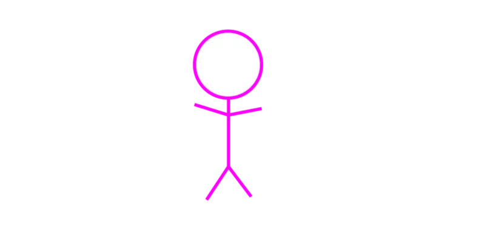

BEM命名规范
==========

## 什么是 BEM 命名规范

* Bem 是块（block）、元素（element）、修饰符（modifier）的简写，由 Yandex 团队提出的一种前端 CSS 命名方法论。但是，这个block并非inline-block里的block，而是将所有东西都划分为一个独立的模块，一个header是一个block，header里嵌套的搜索框是block，甚至于一个icon也会是一个block。而对Element，如果一个Element-son是另一个Element-father的子元素，那么写法是Block__Element-father__Element-son_Modifer，嵌套多了会特别长，是这样么？答案是肯定不是的。一个Block下的所有Element无论相互层级如何，都要摊开扁平的属于Block，所以BEM最多只有B+E+E...+E+M这种超长的命名，也要求E不能同名。Modifier，也就是我们之前经常写的.active, .checked等

> - 中划线：仅作为连字符使用，表示某个块或者某个子元素的多单词的之间的连接记号

> __ 双下划线： 双下划线用来连接块和块的子元素

> _ 单下划线：单下划线用来描述一个块或者块的子元素的一种状态

* BEM 是一个简单又非常有用的命名约定。让你的前端代码更容易阅读和理解，更容易协作，更容易控制，更加健壮和明确，而且更加严密。

### BEM命名模式

BEM的一般命名模式是：

```css
.block{}
.block__element{}
.block--modifier{}
```

* 每一个块(block)名应该有一个命名空间（前缀）

  * block 代表了更高级别的抽象或组件。
  * block__element 代表 .block 的后代，用于形成一个完整的 .block 的整体。
  * block--modifier 代表 .block 的不同状态或不同版本。使用两个连字符和下划线而不是一个，是为了让你自己的块可以用单个连字符来界定。如：

```css
.sub-block__element {}

.sub-block--modifier {}
```

### BEM命名的好处

BEM的关键是，可以获得更多的描述和更加清晰的结构，从其名字可以知道某个标记的含义。于是，通过查看 HTML 代码中的 class 属性，就能知道元素之间的关联。

常规的命名法示例：

```html
<div class="article">
    <div class="body">
        <button class="button-primary"></button>
        <button class="button-success"></button>
    </div>
</div>
```

* 这种写法从 DOM 结构和类命名上可以了解每个元素的意义，但无法明确其真实的层级关系。在 css 定义时，也必须依靠层级选择器来限定约束作用域，以避免跨组件的样式污染。

使用了 BEM 命名方法的示例：

```html
<div class="article">
    <div class="article__body">
        <div class="tag"></div>
        <button class="article__button--primary"></button>
        <button class="article__button--success"></button>
    </div>
</div>
```

* 通过 BEM 命名方式，模块层级关系简单清晰，而且 css 书写上也不必作过多的层级选择。

### 如何使用BEM

#### 什么时候应该用 BEM 格式

* 使用 BEM 的诀窍是，你要知道什么时候哪些东西是应该写成 BEM 格式的。

* 并不是每个地方都应该使用 BEM 命名方式。当需要明确关联性的模块关系时，应当使用 BEM 格式。

* 比如只是一条公共的单独的样式，就没有使用 BEM 格式的意义：

```css
.show{
  display: block;
}
```

#### 在CSS预处理器中使用BEM

* BEM 的一个槽点是，命名方式长而难看，书写不雅。相比 BEM 格式带来的便利来说，我们应客观看待。

* 而且，一般来说会使用通过 LESS/SASS 等预处理器语言来编写 CSS，利用其语言特性书写起来要简单很多：

> 以less为例：

```less
.article {
  max-width: 1200px;
  &__body {
    padding: 20px;
  }
  &__button {
    padding: 5px 8px;
    &--primary {background: blue;}
    &--success {background: green;}
  }
}
```

#### 在流行框架的组件中使用BEM

* 在当前流行的 `Vue.js` / `React` / `Angular` 等前端框架中，都有 CSS 组件级作用域的编译实现，其基本原理均为利用 CSS 属性选择器特性，为不同的组件生成不同的属性选择器。

* 当你选择了这种局部作用域的写法时，在较小的组件中，BEM 格式可能显得没那么重要。但对于公共的、全局性的模块样式定义，还是推荐使用 BEM 格式。

* 另外，对于对外发布的公共组件来说，一般为了风格的可定制性，都不会使用这种局部作用域方式来定义组件样式。此时使用 BEM 格式也会大显其彩。

#### 避免 .block__el1__el2 的格式

* 在深层次嵌套的 DOM
* 结构下，应避免过长的样式名称定义。
* 层级最好不要超过 4 级，不然增加阅读的理解难度

### 实战

网上有一个关于css BEM命名法的经典解释案例--火柴人，喏，就下面这位：



很明显的，我们可以把这个火柴人当做一个组件。既然是组件，那就包含一块一块的内容。

下面让我们用刚刚解释过的BEM语法，来`拆解`一下这个火柴人

经过上面的内容得知，block意为`块`，在实际的业务开发中，更为具体的代表为：导航、侧边、头部、轮播、主体等等。

**这里，值得插播一句的是，块级作用域我们希望以`jq-`作为起始，后面紧跟block，比如 jq-nav、jq-header等**

下面，我们接着说这个`火柴人`

按照上面的规范，我们应该这么写：

```css
.jq-man{}
```

从上面的介绍中，我们知道，E代表元素，`拆解`后的火柴人包含3部分元素：头部、躯干、脚部

所以，基于此，上面的命名方式为：

```css
.jq-man__head{}
.jq-man__body{}
.jq-man__foot{}
```

M表示修饰符(modifier), 假如我们需要给不同的火柴人赋能，比如说大小火柴人、动静火柴人等

```css
.jq-man--small{}
.jq-man--big{}
.jq-man--action{}
.jq-man--slient{}
```

如果，我们需要表示火柴人头部的大小，那用BEM来解释：

```css
.jq-man__head--big{}
.jq-man__head--small{}
```

### 总结

一般来说，在比较小的项目里，比如小程序热力图等，往往连字符分割法就能满足需求，但是不可避免的是，项目会越来越庞大，交互越来越复杂，随着项目的庞大及人员的流动，我们迫切需要统一编码规范、css命名规范等，这样会极大的节约熟悉代码、统一规范的时间。
