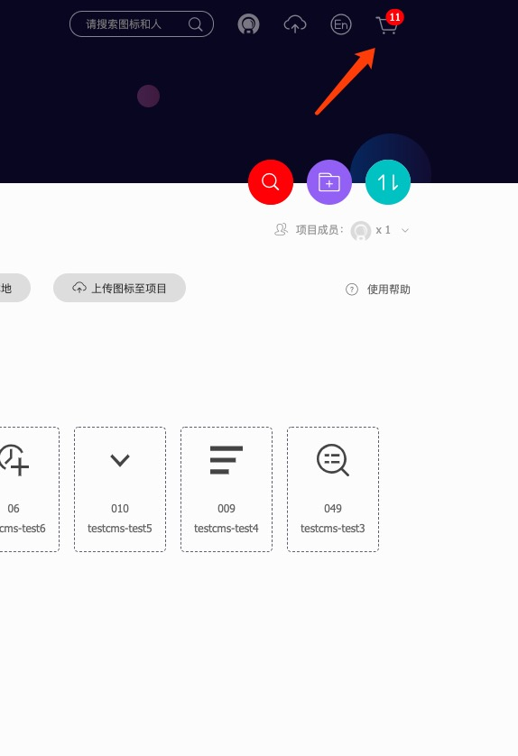

如何在项目中引入阿里的icon-font
===========================

在日常项目开发中，经常不可避免的要引入icon资源，擅长vue框架的elementUI组件库以及react框架的antd组件库的同学对此一定不陌生。我们在使用前辈们开源的UI组件时，配置好相关开发环境后，很容易的就可以用
```html
<icon class="icon icon-**"></icon>
```
来使用图标icon，那么作为国内最大的icon开源网站的iconfont，该如何使用呢？

## 如何使用iconfont

以下内容亲测有效，且假设你已登录iconfont，默认使用font class形式引入

### 新建项目


<font style="color: red;">说明：</font>

1. 因为icon肯定会下载至一个项目中，所以此处先新建项目

2. 图中FontClass/symbol 前缀 意思是和你使用开源UI组件一样，先写的icon 默认为icon，可自定义（比如为test）

3. Font Family 意思是自定义使用时的第二个类名的名称 比如icontest

### 生成font class的相关文件

添加你需要的icon到你需要的项目或者公司的项目中，点击刚才新建的项目名


如上图所示，选中你的项目，选择font class的引入方式，然后点击批量操作，如下图所示：


勾选全选，点击批量加入购物车功能，在页面最上方的购物车里，即可看见：



点击该购物车,在弹出的抽屉中你就能看到你选中的所有icon


点击下载代码，将代码下载至本地


如上图，展示的即为解压之后的全部文件格式

### 将生成的相关文件引入到项目中

如上图所示，将iconfont.css拷贝至您的项目的相关位置（楼主使用vue，一个demo示例工程）


在main.js中引入该样式文件


此时尚未引入成功，仍不能使用，因为打开上图test.css 我们发现，自定义的font-face的src的资源都是本地的，所以此处有2种做法，

* 将所需的字体文件都拷贝至该css所在目录（会增大工程体积）

* 引用网络资源

此处，我们选择第二种 引用网络资源

### 引用该项目的网络资源的icon文件

在iconfont自己的项目下（如我的项目：hugh）


点击生成代码，然后你会得到如下所示格式的一串代码：


拷贝该串代码<font style="color: red;">注意：要去掉.css</font>，至test.css文件


将上述代码去掉.css后缀后，替换文中标红的区域

### 在项目中使用


页面中的显示结果为：


如上图所示，+ 号出现了

至此，项目中成功引入iconfont并正常显示

### 后记

1、不知道细心的你发现没有，我们在创建项目时设置的 `FontClass` 以及 `font family` 并未生效，仍是默认的iconfont类，楼主因为开发任务，暂不深究该问题，有注意到的小伙伴可以在下方留言告知，在此感谢！

### 20190426更新

貌似楼主发现了问题所在，大家注意到test.css中顶部定义的样式类名没有，发现是iconfont，如果将此改为icontest，那么项目中引入的时候第一个样式类名应该为icontest

但是此问题仍不是新建项目时设置的font family的名字，百思不得解。

## 第二种使用方式

如果您想继续使用font class类 但是上述方式 当图标变更后，每次都要下载文件比较麻烦，以下或许会是比较简便的方法


然后直接在项目的html代码里 直接引入


然后使用方式还是和之前一样，直接使用类名就OK（切记类名为你在iconfont里图标下面的名称）

