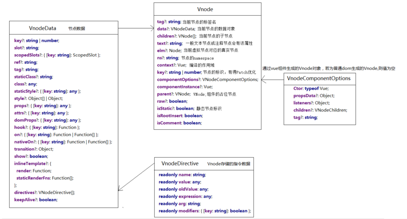
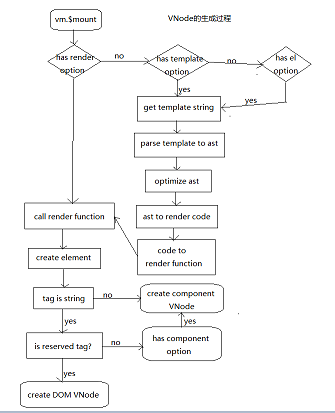
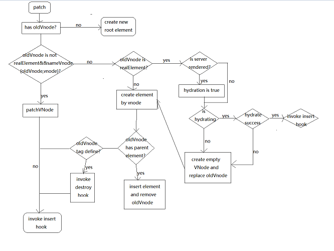
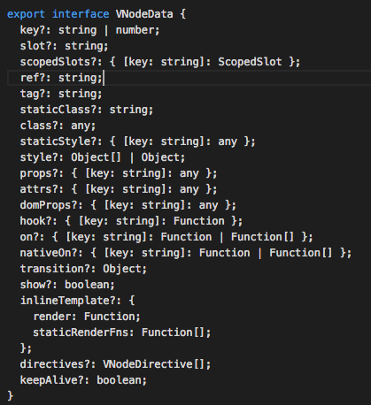
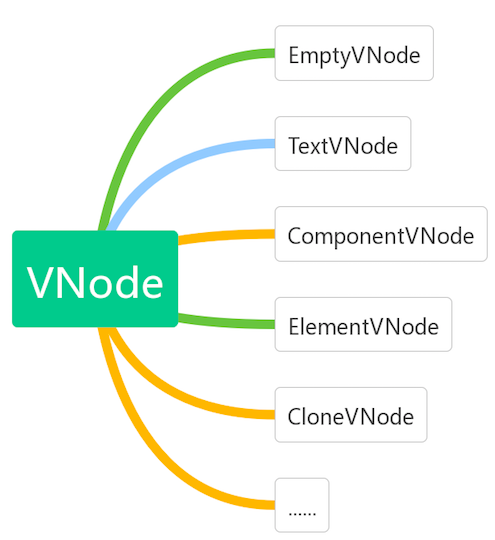
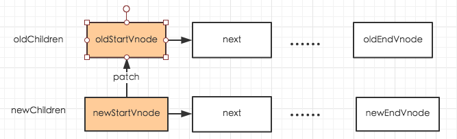
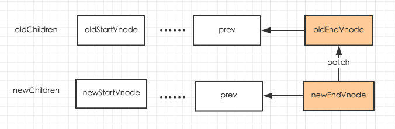
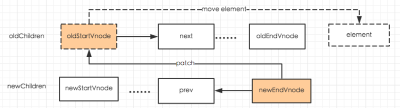
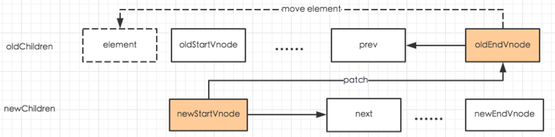
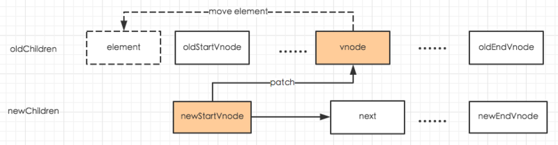

vue虚拟dom的实现
===============

`Vitual DOM` 是一种虚拟的dom技术，本质上是基于js实现的，相较于dom对象，js对象更简单，处理速度更快，dom树的结构、属性信息都可以很容易的用js对象来表示：

```js
let element={
    tagName:'ul',//节点标签名
    props:{//dom的属性，用一个对象存储键值对
        id:'list'
    },
    children:[//该节点的子节点
        {tagName:'li',props:{class:'item'},children:['aa']}，
        {tagName:'li',props:{class:'item'},children:['bb']},
        {tagName:'li',props:{class:'item'},children:['cc']}
    ]
}
对应的html写法是：
<ul id='list'>
    <li class='item'>aa</li>
    <li class='item'>aa</li>
    <li class='item'>aa</li>
</ul>
```

Virtual DOM并没有完全实现DOM，Virtual DOM最主要的还是保留了Element之间的层次关系和一些基本属性. 你给我一个数据，我根据这个数据生成一个全新的Virtual DOM，然后跟我上一次生成的Virtual DOM去 diff，得到一个Patch，然后把这个Patch打到浏览器的DOM上去。

我们可以通过javascript对象表示的树结构来构建一棵真正的dom树，当数据状态发生变化时，可以直接修改这个javascript对象，接着对比修改后的javascript对象，记录下需要对页面做的dom操作，然后将其应用到真正的dom树，实现视图的更新，这个过程就是Virtual DOM的核心思想。

VNode的数据结构图：



---



VNode生成最关键的点是通过render有2种生成方式:

* 第一种是直接在vue对象的option中添加render字段。

* 第二种是写一个模板或指定一个el根元素，它会首先转换成模板，经过html语法解析器生成一个ast抽象语法树，对语法树做优化，然后把语法树转换成代码片段，最后通过代码片段生成function添加到option的render字段中。

ast语法优的过程，主要做了2件事：

* 会检测出静态的class名和attributes,这样它们在初始化渲染后就永远不会再被比对了。

* 会检测出最大的静态子树（不需要动态性的子树）并且从渲染函数中萃取出来。这样在每次重渲染时，它就会直接重用完全相同的vnode，同时跳过比对。


```js
src/core/vdom/create-element.js

const SIMPLE_NORMALIZE = 1
const ALWAYS_NORMALIZE = 2

function createElement (context, tag, data, children, normalizationType, alwaysNormalize) {
  // 兼容不传data的情况
  if (Array.isArray(data) || isPrimitive(data)) {
    normalizationType = children
    children = data
    data = undefined
  }
  // 如果alwaysNormalize是true
  // 那么normalizationType应该设置为常量ALWAYS_NORMALIZE的值
  if (alwaysNormalize) normalizationType = ALWAYS_NORMALIZE
  // 调用_createElement创建虚拟节点
  return _createElement(context, tag, data, children, normalizationType)
}

function _createElement (context, tag, data, children, normalizationType) {
  /**
   * 如果存在data.__ob__，说明data是被Observer观察的数据
   * 不能用作虚拟节点的data
   * 需要抛出警告，并返回一个空节点
   * 被监控的data不能被用作vnode渲染的数据的原因是：
   * data在vnode渲染过程中可能会被改变，这样会触发监控，导致不符合预期的操作
   */
  if (data && data.__ob__) {
    process.env.NODE_ENV !== 'production' && warn(
      `Avoid using observed data object as vnode data: ${JSON.stringify(data)}\n` +
      'Always create fresh vnode data objects in each render!',
      context
    )
    return createEmptyVNode()
  }
  // 当组件的is属性被设置为一个falsy的值
  // Vue将不会知道要把这个组件渲染成什么
  // 所以渲染一个空节点
  if (!tag) {
    return createEmptyVNode()
  }
  // 作用域插槽
  if (Array.isArray(children) &&
      typeof children[0] === 'function') {
    data = data || {}
    data.scopedSlots = { default: children[0] }
    children.length = 0
  }
  // 根据normalizationType的值，选择不同的处理方法
  if (normalizationType === ALWAYS_NORMALIZE) {
    children = normalizeChildren(children)
  } else if (normalizationType === SIMPLE_NORMALIZE) {
    children = simpleNormalizeChildren(children)
  }
  let vnode, ns
  // 如果标签名是字符串类型
  if (typeof tag === 'string') {
    let Ctor
    // 获取标签名的命名空间
    ns = config.getTagNamespace(tag)
    // 判断是否为保留标签
    if (config.isReservedTag(tag)) {
      // 如果是保留标签,就创建一个这样的vnode
      vnode = new VNode(
        config.parsePlatformTagName(tag), data, children,
        undefined, undefined, context
      )
      // 如果不是保留标签，那么我们将尝试从vm的components上查找是否有这个标签的定义
    } else if ((Ctor = resolveAsset(context.$options, 'components', tag))) {
      // 如果找到了这个标签的定义，就以此创建虚拟组件节点
      vnode = createComponent(Ctor, data, context, children, tag)
    } else {
      // 兜底方案，正常创建一个vnode
      vnode = new VNode(
        tag, data, children,
        undefined, undefined, context
      )
    }
    // 当tag不是字符串的时候，我们认为tag是组件的构造类
    // 所以直接创建
  } else {
    vnode = createComponent(tag, data, context, children)
  }
  // 如果有vnode
  if (vnode) {
    // 如果有namespace，就应用下namespace，然后返回vnode
    if (ns) applyNS(vnode, ns)
    return vnode
  // 否则，返回一个空节点
  } else {
    return createEmptyVNode()
  }
}
```

方法的功能是给一个Vnode对象对象添加若干个子Vnode,因为整个Virtual DOM是一种树状结构，每个节点都可能会有若干子节点。然后创建一个VNode对象

* 如果是一个reserved tag(比如html,head等一些合法的html标签)则会创建普通的DOM VNode

* 如果是一个component tag(通过vue注册的自定义component)，则会创建Component VNode对象，它的VnodeComponentOptions不为Null.

创建好Vnode,下一步就是要把Virtual DOM渲染成真正的DOM，是通过patch来实现的，源码如下：

```js
src/core/vdom/patch.js

return function patch (oldVnode, vnode, hydrating, removeOnly, parentElm, refElm) { // oldVnoe:dom||当前vnode,vnode:vnoder=对象类型,hydration是否直接用服务端渲染的dom元素
if (isUndef(vnode)) {
    if (isDef(oldVnode)) invokeDestroyHook(oldVnode)
    return
}

let isInitialPatch = false
const insertedVnodeQueue = []

if (isUndef(oldVnode)) {
    // 空挂载(可能是组件)，创建新的根元素。
    isInitialPatch = true
    createElm(vnode, insertedVnodeQueue, parentElm, refElm)
} else {
    const isRealElement = isDef(oldVnode.nodeType)
    if (!isRealElement && sameVnode(oldVnode, vnode)) {
    // patch 现有的根节点
    patchVnode(oldVnode, vnode, insertedVnodeQueue, removeOnly)
    } else {
    if (isRealElement) {
        // 安装到一个真实的元素。
        // 检查这是否是服务器渲染的内容，如果我们可以执行。
        // 成功的水合作用。
        if (oldVnode.nodeType === 1 && oldVnode.hasAttribute(SSR_ATTR)) {
        oldVnode.removeAttribute(SSR_ATTR)
        hydrating = true
        }
        if (isTrue(hydrating)) {
        if (hydrate(oldVnode, vnode, insertedVnodeQueue)) {
            invokeInsertHook(vnode, insertedVnodeQueue, true)
            return oldVnode
        } else if (process.env.NODE_ENV !== 'production') {
            warn(
            'The client-side rendered virtual DOM tree is not matching ' +
            'server-rendered content. This is likely caused by incorrect ' +
            'HTML markup, for example nesting block-level elements inside ' +
            '<p>, or missing <tbody>. Bailing hydration and performing ' +
            'full client-side render.'
            )
        }
        }
        // 不是服务器呈现，就是水化失败。创建一个空节点并替换它。
        oldVnode = emptyNodeAt(oldVnode)
    }

    // 替换现有的元素
    const oldElm = oldVnode.elm
    const parentElm = nodeOps.parentNode(oldElm)

    // create new node
    createElm(
        vnode,
        insertedVnodeQueue,
        // 极为罕见的边缘情况:如果旧元素在a中，则不要插入。
        // 离开过渡。只有结合过渡+时才会发生。
        // keep-alive + HOCs. (#4590)
        oldElm._leaveCb ? null : parentElm,
        nodeOps.nextSibling(oldElm)
    )

    // 递归地更新父占位符节点元素。
    if (isDef(vnode.parent)) {
        let ancestor = vnode.parent
        const patchable = isPatchable(vnode)
        while (ancestor) {
        for (let i = 0; i < cbs.destroy.length; ++i) {
            cbs.destroy[i](ancestor)
        }
        ancestor.elm = vnode.elm
        if (patchable) {
            for (let i = 0; i < cbs.create.length; ++i) {
            cbs.create[i](emptyNode, ancestor)
            }
            // #6513
            // 调用插入钩子，这些钩子可能已经被创建钩子合并了。
            // 例如使用“插入”钩子的指令。
            const insert = ancestor.data.hook.insert
            if (insert.merged) {
            // 从索引1开始，以避免重新调用组件挂起的钩子。
            for (let i = 1; i < insert.fns.length; i++) {
                insert.fns[i]()
            }
            }
        } else {
            registerRef(ancestor)
        }
        ancestor = ancestor.parent
        }
    }

    // destroy old node
    if (isDef(parentElm)) {
        removeVnodes(parentElm, [oldVnode], 0, 0)
    } else if (isDef(oldVnode.tag)) {
        invokeDestroyHook(oldVnode)
    }
    }
}

invokeInsertHook(vnode, insertedVnodeQueue, isInitialPatch)
return vnode.elm
}
```

patch支持的3个参数，其中

* oldVnode是一个真实的DOM或者一个VNode对象，它表示当前的VNode

* vnode是VNode对象类型，它表示待替换的VNode

* hydration是bool类型，它表示是否直接使用服务器端渲染的DOM元素

下面流程图表示patch的运行逻辑：

---



patch运行逻辑看上去比较复杂，有2个方法createElm和patchVnode是生成dom的关键，源码如下：

```js
/**
 * @param vnode根据vnode的数据结构创建真实的dom节点，如果vnode有children则会遍历这些子节点，递归调用createElm方法，
 * @param insertedVnodeQueue记录子节点创建顺序的队列，每创建一个dom元素就会往队列中插入当前的vnode，当整个vnode对象全部转换成为真实的dom 树时，会依次调用这个队列中vnode hook的insert方法
 */
let inPre = 0
function createElm (vnode, insertedVnodeQueue, parentElm, refElm, nested) {
vnode.isRootInsert = !nested // 过渡进入检查
if (createComponent(vnode, insertedVnodeQueue, parentElm, refElm)) {
    return
}

const data = vnode.data
const children = vnode.children
const tag = vnode.tag
if (isDef(tag)) {
    if (process.env.NODE_ENV !== 'production') {
    if (data && data.pre) {
        inPre++
    }
    if (
        !inPre &&
        !vnode.ns &&
        !(
        config.ignoredElements.length &&
        config.ignoredElements.some(ignore => {
            return isRegExp(ignore)
            ? ignore.test(tag)
            : ignore === tag
        })
        ) &&
        config.isUnknownElement(tag)
    ) {
        warn(
        'Unknown custom element: <' + tag + '> - did you ' +
        'register the component correctly? For recursive components, ' +
        'make sure to provide the "name" option.',
        vnode.context
        )
    }
    }
    vnode.elm = vnode.ns
    ? nodeOps.createElementNS(vnode.ns, tag)
    : nodeOps.createElement(tag, vnode)
    setScope(vnode)

    /* istanbul ignore if */
    if (__WEEX__) {
    // in Weex, the default insertion order is parent-first.
    // List items can be optimized to use children-first insertion
    // with append="tree".
    const appendAsTree = isDef(data) && isTrue(data.appendAsTree)
    if (!appendAsTree) {
        if (isDef(data)) {
        invokeCreateHooks(vnode, insertedVnodeQueue)
        }
        insert(parentElm, vnode.elm, refElm)
    }
    createChildren(vnode, children, insertedVnodeQueue)
    if (appendAsTree) {
        if (isDef(data)) {
        invokeCreateHooks(vnode, insertedVnodeQueue)
        }
        insert(parentElm, vnode.elm, refElm)
    }
    } else {
    createChildren(vnode, children, insertedVnodeQueue)
    if (isDef(data)) {
        invokeCreateHooks(vnode, insertedVnodeQueue)
    }
    insert(parentElm, vnode.elm, refElm)
    }

    if (process.env.NODE_ENV !== 'production' && data && data.pre) {
    inPre--
    }
} else if (isTrue(vnode.isComment)) {
    vnode.elm = nodeOps.createComment(vnode.text)
    insert(parentElm, vnode.elm, refElm)
} else {
    vnode.elm = nodeOps.createTextNode(vnode.text)
    insert(parentElm, vnode.elm, refElm)
}
}
```

方法会根据vnode的数据结构创建真实的DOM节点

* 如果vnode有children，则会遍历这些子节点，递归调用createElm方法，

* InsertedVnodeQueue是记录子节点创建顺序的队列，每创建一个DOM元素就会往这个队列中插入当前的VNode,当整个VNode对象全部转换成为真实的DOM树时，会依次调用这个队列中的VNode hook的insert方法。

```js
    /**
     * 比较新旧vnode节点，根据不同的状态对dom做合理的更新操作（添加，移动，删除）整个过程还会依次调用prepatch,update,postpatch等钩子函数，在编译阶段生成的一些静态子树，在这个过程
     * @param oldVnode 中由于不会改变而直接跳过比对，动态子树在比较过程中比较核心的部分就是当新旧vnode同时存在children，通过updateChildren方法对子节点做更新，
     * @param vnode
     * @param insertedVnodeQueue
     * @param removeOnly
     */
  function patchVnode (oldVnode, vnode, insertedVnodeQueue, removeOnly) {
    if (oldVnode === vnode) {
      return
    }

    const elm = vnode.elm = oldVnode.elm

    if (isTrue(oldVnode.isAsyncPlaceholder)) {
      if (isDef(vnode.asyncFactory.resolved)) {
        hydrate(oldVnode.elm, vnode, insertedVnodeQueue)
      } else {
        vnode.isAsyncPlaceholder = true
      }
      return
    }

      // 用于静态树的重用元素。
        // 注意，如果vnode是克隆的，我们只做这个。
        // 如果新节点不是克隆的，则表示呈现函数。
        // 由热重加载api重新设置，我们需要进行适当的重新渲染。
    if (isTrue(vnode.isStatic) &&
      isTrue(oldVnode.isStatic) &&
      vnode.key === oldVnode.key &&
      (isTrue(vnode.isCloned) || isTrue(vnode.isOnce))
    ) {
      vnode.componentInstance = oldVnode.componentInstance
      return
    }

    let i
    const data = vnode.data
    if (isDef(data) && isDef(i = data.hook) && isDef(i = i.prepatch)) {
      i(oldVnode, vnode)
    }

    const oldCh = oldVnode.children
    const ch = vnode.children
    if (isDef(data) && isPatchable(vnode)) {
      for (i = 0; i < cbs.update.length; ++i) cbs.update[i](oldVnode, vnode)
      if (isDef(i = data.hook) && isDef(i = i.update)) i(oldVnode, vnode)
    }
    if (isUndef(vnode.text)) {
      if (isDef(oldCh) && isDef(ch)) {
        if (oldCh !== ch) updateChildren(elm, oldCh, ch, insertedVnodeQueue, removeOnly)
      } else if (isDef(ch)) {
        if (isDef(oldVnode.text)) nodeOps.setTextContent(elm, '')
        addVnodes(elm, null, ch, 0, ch.length - 1, insertedVnodeQueue)
      } else if (isDef(oldCh)) {
        removeVnodes(elm, oldCh, 0, oldCh.length - 1)
      } else if (isDef(oldVnode.text)) {
        nodeOps.setTextContent(elm, '')
      }
    } else if (oldVnode.text !== vnode.text) {
      nodeOps.setTextContent(elm, vnode.text)
    }
    if (isDef(data)) {
      if (isDef(i = data.hook) && isDef(i = i.postpatch)) i(oldVnode, vnode)
    }
  }
```
---

## 延伸阅读

### VNode对象

一个VNode的实例对象包含了以下属性：

* tag：当前节点的名称

* data：当前节点的数据对象，具体包含的字段可参看vue源码types/vnode.d.ts中对VNodeData的定义

<div align="center">
<!--  -->
    
</div>

* children：数组类型，包含了当前节点的子节点

* text：当前节点的文本，一般文本节点或注释节点会有该属性

* elm：当前虚拟节点对应的真实的dom节点

* ns：节点的namespace

* context：编译作用域

* functionalContenxt：函数化组件的作用域

* key：节点的key属性，用于作为节点的标识，有利于patch的优化

* componentOptions：创建组件实例时会用到的选项信息

* child：当前节点对应的组件实例

* parent：组件的占位节点

* raw：raw html

* isStatic： 静态节点的的标识

* isRootInsert：是否作为根节点插入，被`<transition>`包裹的节点，该属性的值为false

* isComment：当前节点是否是注释节点

* isCloned：当前节点是否为克隆节点

* isOnce: 当前节点是否有v-once指令

### VNode分类

<div align="center">
    
</div>

VNode可以理解为vue框架的虚拟dom的基类，通过new实例化的VNode大致可以分为几类

* EmptyVNode：没有内容的注释节点

* TextVNode：文本节点

* ElementVNode：普通元素节点

* ComponentVNode：组件节点

* CloneVNode：克隆节点，可以是以上任意类型的节点，唯一的区别在于isCloned属性为true

* ...

### createElement解析

```js
const SIMPLE_NORMALIZE = 1
const ALWAYS_NORMALIZE = 2

function createElement (context, tag, data, children, normalizationType, alwaysNormalize) {
  // 兼容不传data的情况
  if (Array.isArray(data) || isPrimitive(data)) {
    normalizationType = children
    children = data
    data = undefined
  }
  // 如果alwaysNormalize是true
  // 那么normalizationType应该设置为常量ALWAYS_NORMALIZE的值
  if (alwaysNormalize) normalizationType = ALWAYS_NORMALIZE
  // 调用_createElement创建虚拟节点
  return _createElement(context, tag, data, children, normalizationType)
}

function _createElement (context, tag, data, children, normalizationType) {
  /**
   * 如果存在data.__ob__，说明data是被Observer观察的数据
   * 不能用作虚拟节点的data
   * 需要抛出警告，并返回一个空节点
   * 
   * 被监控的data不能被用作vnode渲染的数据的原因是：
   * data在vnode渲染过程中可能会被改变，这样会触发监控，导致不符合预期的操作
   */
  if (data && data.__ob__) {
    process.env.NODE_ENV !== 'production' && warn(
      `Avoid using observed data object as vnode data: ${JSON.stringify(data)}\n` +
      'Always create fresh vnode data objects in each render!',
      context
    )
    return createEmptyVNode()
  }
  // 当组件的is属性被设置为一个falsy的值
  // Vue将不会知道要把这个组件渲染成什么
  // 所以渲染一个空节点
  if (!tag) {
    return createEmptyVNode()
  }
  // 作用域插槽
  if (Array.isArray(children) &&
      typeof children[0] === 'function') {
    data = data || {}
    data.scopedSlots = { default: children[0] }
    children.length = 0
  }
  // 根据normalizationType的值，选择不同的处理方法
  if (normalizationType === ALWAYS_NORMALIZE) {
    children = normalizeChildren(children)
  } else if (normalizationType === SIMPLE_NORMALIZE) {
    children = simpleNormalizeChildren(children)
  }
  let vnode, ns
  // 如果标签名是字符串类型
  if (typeof tag === 'string') {
    let Ctor
    // 获取标签名的命名空间
    ns = config.getTagNamespace(tag)
    // 判断是否为保留标签
    if (config.isReservedTag(tag)) {
      // 如果是保留标签,就创建一个这样的vnode
      vnode = new VNode(
        config.parsePlatformTagName(tag), data, children,
        undefined, undefined, context
      )
      // 如果不是保留标签，那么我们将尝试从vm的components上查找是否有这个标签的定义
    } else if ((Ctor = resolveAsset(context.$options, 'components', tag))) {
      // 如果找到了这个标签的定义，就以此创建虚拟组件节点
      vnode = createComponent(Ctor, data, context, children, tag)
    } else {
      // 兜底方案，正常创建一个vnode
      vnode = new VNode(
        tag, data, children,
        undefined, undefined, context
      )
    }
    // 当tag不是字符串的时候，我们认为tag是组件的构造类
    // 所以直接创建
  } else {
    vnode = createComponent(tag, data, context, children)
  }
  // 如果有vnode
  if (vnode) {
    // 如果有namespace，就应用下namespace，然后返回vnode
    if (ns) applyNS(vnode, ns)
    return vnode
  // 否则，返回一个空节点
  } else {
    return createEmptyVNode()
  }
}
```

### patch原理

patch的函数定义在`src/core/vdom/patch.js`中，我们先来看下这个函数的逻辑

patch函数接收6个参数：

* oldValue：旧的虚拟节点或者旧的真实dom节点

* vnode：新的虚拟节点

* hydrating：是否要跟真实dom混合

* removeOnly：特殊flag，用于`<transition-group>`组件

* parentElm：父节点

* refElm：新节点将插入到refElm之前

patch的策略是：

* 如果vnode不存在但是oldVnode存在，说明意图是要销毁老节点，那么就调用invokeDestroyHook(oldVnode)来进行销毁

* 如果oldVnode不存在但是vnode存在，说明意图是要创建新节点，那么就调用createElm来创建新节点

* 当vnode和oldVnode都存在时

    * 如果oldVnode和vnode是同一个节点，就调用patchVnode来进行patch

    * 当vnode和oldVnode不是同一个节点时，如果oldVnode是真实dom节点或hydrating设置为true，需要用hydrate函数将虚拟dom和真实dom进行映射，然后将oldVnode设置为对应的虚拟dom，找到oldVnode.elm的父节点，根据vnode创建一个真实dom节点并插入到该父节点中oldVnode.elm的位置

这里面值得一提的是`patchVnode`函数，因为真正的patch算法是由它来实现的（patchVnode中更新子节点的算法其实是在updateChildren函数中实现的，为了便于理解，我统一放到patchVnode中来解释）。

patch算法是：

* 如果oldVnode和vnode完全一致，那么不需要做任何事情

* 如果oldVnode和vnode都是静态节点，且具有相同的key，当vnode是克隆节点或者v-once指令控制的节点时，只需要把oldVnode.elm和oldVnode.child都复制到vnode上，也不用再有其他操作

* 否则，如果vnode不是文本节点或者注释节点

    * 如果oldVnode和vnode都有子节点，且两方的子节点不完全一致，就执行更新子节点的操作（这一部分其实是在updateChildren函数中实现），算法如下：

        * 分别获取oldVnode和vnode的firstchild、lastchild，赋值给oldStartVnode、oldEndVnode、newStartVnode、newEndVnode

        * 如果oldStartVnode和newStartVnode是同一节点，调用patchVnode进行patch，然后将oldStartVnode和newStartVnode都设置为下一个子节点，重复上述流程

        <div align="center">
            
        </div>

        * 如果oldEndVnode和newEndVnode是同一节点，调用patchVnode进行patch，然后将oldEndVnode和newEndVnode都设置为上一个节点，重复上述流程

        <div align="center">
            
        </div>

        * 如果oldStartVnode和newEndVnode是同一节点，调用patchVnode进行patch，如果removeOnly是false，那么可以把oldStartVnode.elm移动到oldEndVnode.elm之后，然后把oldStartVnode设置为下一个节点，newEndVnode设置为上一个节点，重复上述流程

        <div align="center">
            
        </div>

        * 如果newStartVnode和oldEndVnode是同一节点，调用patchVnode进行patch，如果removeOnly是false，那么可以把oldEndVnode.elm移动到oldStartVnode.elm之后，然后把newStartVnode设置为下一个节点，oldEndVnode设置为上一个节点，重复上述流程

        <div align="center">
            
        </div>

        * 如果以上都不匹配，就尝试在oldChildren中寻找跟newStartVnode具有相同key的节点，如果找不到相同key的节点，说明newStartVnode是一个新节点，就创建一个，然后把newStartVnode设置为下一个节点

        * 如果上一步找到了跟newStartVnode相同key的节点，那么通过其他属性的比较来判断这2个节点是否是同一个节点，如果是就调用patchVnode进行patch，如果removeOnly是false，就把newStartVnode.elm插入到oldStartVnode.elm之前，把newStartVnode.elm插入到oldStartVnode.elm之前，把newStartVnode设置为下一个节点，重复上述流程

        <div align="center">
            
        </div>

        * 如果在oldChildren中没有寻找到newStartVnode的同一节点，那就创建一个新节点，把newStartVnode设置为下一个节点，重复上述流程

        * 如果oldStartVnode跟oldEndVnode重合了，并且newStartVnode和newEndVnode也重合了，这个循环就结束了

    * 如果只有oldVnode有自接地啊，那就把这些节点都删除

    * 如果只有vnode有子节点，那就创建这些子节点

    * 如果oldVnode和vnode都没有子节点，但是oldVnode是文本节点或注释节点，那就把vnode.elm的文本设置为空字符串

* 如果vnode是文本节点或注释节点，但是vnode.text != oldVnode.text时，只需要更新vnode.elm的文本内容就可以

### 生命周期

patch提供了5个生命周期钩子，分别是

* create：创建patch时

* activate：激活组件时

* update： 更新节点时

* remove：移除节点时

* destroy：销毁节点时

这些钩子是提供给Vue内部的directives/ref/attrs/style等模块使用的，方便这些模块在patch的不同阶段进行相应的操作，这里模块定义在src/core/vdom/modules和src/platforms/web/runtime/modules2个目录中

vnode也提供了生命周期钩子，分别是

* init: vdom初始化时

* create: vdom创建时

* prepatch: patch之前

* insert: vdom插入后

* update: vdom更新前

* postpatch: patch之后

* remove: vdom移除时

* destroy: vdom销毁时

vue组件的生命周期底层其实就依赖于vnode的生命周期，在src/core/vdom/create-component.js中我们可以看到，vue为自己的组件vnode已经写好了默认的init/prepatch/insert/destroy，而vue组件的mounted/activated就是在insert中触发的，deactivated就是在destroy中触发的
